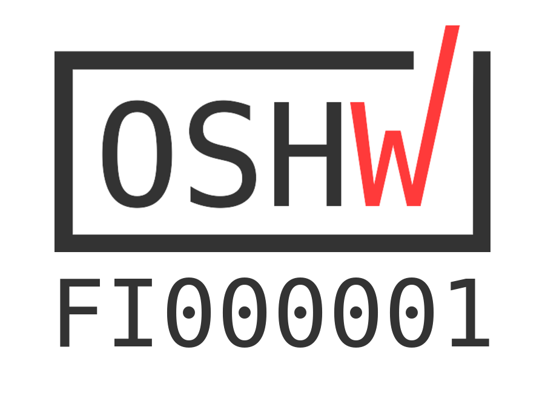

# 4chord MIDI - The Four Chord USB MIDI Keyboard

What does it take to create a hit pop song?

Australia's former comedy group [The Axis of Awesome](https://en.wikipedia.org/wiki/The_Axis_of_Awesome) had the answer: [Four chords](https://www.youtube.com/watch?v=5pidokakU4I). Though not just any four chords, but the [I-V-vi-IV chord progression](https://en.wikipedia.org/wiki/I%E2%80%93V%E2%80%93vi%E2%80%93IV_progression) to be precise. This project implements a USB MIDI device for the purpose of playing this exact four-chord progression.

4chord MIDI is a regular USB MIDI controller, just like any other MIDI keyboard, except it has just four buttons, one for each chord in the I-V-vi-IV chord progression, playable in any key. But since simply playing chords is a bit limiting, it also features different playback modes such as triad arpeggios and chords mixed with arpeggios. Additionally, the tempo of each note progression is selectable from 30bpm to 240bpm. It's even shaped like a piano, to give the real feel of playing an actual musical instrument.

For additional information, check out [the 4chord MIDI project website](https://4chord.craplab.fi) and [its hackaday.io project page](https://hackaday.io/project/26078-4chord-midi).

4chord MIDI is fully open source and certified as such by the [Open Source Hardware Association (OSHWA)](https://www.oshwa.org/). The hardware is licensed under the [CERN Open Hardware License v.1.2](http://www.ohwr.org/projects/cernohl/wiki) and the software is released under the [GNU General Public License version 2](http://www.gnu.org/licenses/old-licenses/gpl-2.0.en.html).

<p align="center">
<a href="https://certification.oshwa.org/fi000001.html"></a>
</p>

## Table of Contents
  * [Quick Start](#quick-start)
  * [Project Structure](#project-structure)
  * [Build it](#build-it)
  * [Flash it](#flash-it)
  * [Use it](#use-it)
  * [User Interface](#user-interface)
  * [Troubleshooting](#troubleshooting)

## Quick Start

If you're not interested in the details, here's the quickest way to build and flash a 4chord MIDI device. Note that the Makefile is set up to expect USBasp as programmer. If you're using a different programmer, check the [flashing section](#flash-it) for more details.

### Dependencies
Make sure you have the dependencies to build the bootloader and firmware installed on your system.

For Ubuntu, Debian, and the likes, this should be:
```
$ sudo apt install gcc-avr avr-libc avr-binutils avrdude make
```
For Fedora etc. it should be:
```
$ sudo dnf install avr-gcc avr-libc avr-binutils avrdude make
```
For Arch it should be ~~FUCKING OBVIOUS AND YOU'RE NOT WORTHY TO USE THIS GLORIOUS DISTRO IF YOU HAVE TO ASK A LAME QUESTION LIKE THIS~~ the same package names as for Fedora:
```
$ sudo pacman -S avr-gcc avr-libc avr-binutils avrdude make
```

Unfortunately, I don't have the answer for any other distribution, MacOS, or Windows, but essentially, it's just the regular AVR toolchain components (and `make`), so checking a general setup guide for the AVR toolchain on that system should get you there. Presumably it follows the same package names as mentioned so far.

### Cloning, Building, Flashing

Clone the repository and change into it:
```
$ git clone https://github.com/sgreg/4chord-midi.git
$ cd 4chord-midi/
```

Build the bootloader and firmware:
```
$ make
```

Make sure the ATmega's fuses are set up properly:
```
$ make fuses
```

Flash it to the device:
```
$ make program
```


That's it, your 4chord MIDI device should be ready to go, and once plugged in, recognized as as such. Check the [usage section](#use-it) for a quick overview of how to connect it to *FluidSynth* to get your first chords played.

If you *are* interested in more details, well here they come.


## Project Structure

* [`bootloader/`](bootloader/) the bootloader for comfortable firmware update flashing
* [`firmware/`](firmware/) the main 4chord MIDI firmware code
* [`graphics/`](graphics/) raw [XBM](https://en.wikipedia.org/wiki/X_BitMap) files used within the GUI and intro animation
* [`hardware/`](hardware/) schematic and PCB design files
* [`sys/`](sys/) Linux system scripts (udev rules and setup scripts)
* [`tools/`](tools/) additional tools to convert graphics and dump fuse settings
* [`Makefile`](Makefile) main entry point to built it all
* [`common.mk`](common.mk) shared data related to building
* everything else: this README and git stuff


## Build it

From firmware point of view, there are three main parts to build here:
1. the raw XBM graphics converted to easily dump to the Nokia LCD (shipped pre-built)
1. the bootloader for future firmware updates via USB (optional but recommended)
1. the actual firmware

### Graphics
As the graphics parts come pre-built ([`intro.c`](firmware/intro.c)/[`intro.h`](firmware/intro.h) for the intro animation, [`gfx.c`](firmware/gfx.c)/[`gfx.h`](firmware/gfx.h) for all GUI related graphic elements), there's nothing to do, unless you want to change the [`graphics/`](graphics/) content by either adding new XBM files, or modifying the existing ones. In that case, once the graphics are modified, run:
```
$ make graphics
```
from the project's root path, which will delete all previously generated files and re-create them.

### Bootloader

You can build and flash the bootloader on its own without the main 4chord MIDI firmware. If this is your first time with the code, you might want to skip this option and go straight to the [Bootloader with Firmware](#bootloader-with-firmware) section for now.

But let's say you want to play around with just the bootloader and flash the application firmware through USB later, or make modifications to the bootloader itself. In that case, the bootloader can be built from the project's root directory via
```
$ make bootloader
```

or from within the `bootloader/device/` directory via `make` on its own.

This will create the bootloader's ELF and HEX file in the `bootloader/device/` directory, ready to be flashed to the device. Instructions on flashing [follow below](#flash-it).

**Note that this will build only the bootloader but not the firmware, so the device won't act as USB MIDI controller afterwards!**

Also note that once [flashed](#flash-it), the bootloader needs to be manually activated by pressing the *Select* button when powering the device up, otherwise it will fall through to the application code - which in this case won't exist. As a result, the device is stuck in a boot loop until the *Select* key is pressed. In other words, if the device seems dead after flashing the bootloader, just press the *Select* button to start up the actual bootloader.

### Firmware

As with the bootloader mentioned above, the firmware can be built and flashed on its own without adding the bootloader to it. This makes sense if you make any changes to the firmware code without touching the bootloader, but keep in mind that [flashing](#flash-it) the firmware on its own will leave out the bootloader, so future firmware updates via USB won't be possible (but you can always just re-flash the device with both components, so there's no harm done).

To build the firmware on its own from the project root directory, simply call

```
$ make firmware
```

To build it straight from within the `firmware/` directory, simply run `make` in there.

This will again create the ELF and HEX file inside the `firmware/` directory, and in addition, a BIN file. The HEX file is used for [flashing](#flash-it), while the BIN file is used in the firmware upgrade via USB using the bootloader.

### Bootloader with Firmware

To get the full package of bootloader and firmware, simply call
```
$ make
```
from within the project's root directory.

This will build both components separately, and the resulting ELF, HEX, and in case of the firmware, BIN file will be afterwards located in `bootloader/device/` and `firmware/` respectively.

You should now have either one of them built and ready to be flashed to the device.

## Flash it

If you're building your own device, you will require an AVR programmer to flash the initial bootloader and/or firmware to it. If you got a ready-made device, it will come with an initial bootloader and firmware already flashed on it, in which case you can either still use an AVR programmer to update it, or use the bootloader's built-in update functionality.

### Flashing with an AVR Programmer

The build system is set up to expect USBasp as programmer, so if you're using a different programmer, flashing is of course going to fail. To set up the build system for your programmer, check the [`common.mk`](common.mk) file for the following line:

```
AVRDUDE_PROGRAMMER_FLAGS = -c usbasp
```
and adjust it to your needs. If the programmer requires an additional port parameter, add the `-P <port>` accordingly.


Note that the device uses a 6-pin ISP connector, although some programmers - including a regular USBasp programmer - comes with a 10-pin connector. The 10-pin version has in the end just 4 additional, unused pins, which seems unnecessary, so the choice was to go for the 6-pin version here. The connectors are otherwise compatible, it just needs either an adapter or manual wiring.

To make sure the programmer is set up properly, connect it to the 4chord MIDI device and run
```
$ make check-programmer
```
from within the project's root directory. If both the programmer and device was detected, you should `SUCCESS` displayed in the end. Note that if you didn't connect the 4chord MIDI device, you might still see `FAILURE` even though the programmer is set up correctly. `avrdude`'s error message should hopefully give some hints which part went wrong then.

If everything is happily set up, connect the programmer to the device and get ready to flash.

Depending on the parts you [built earlier](#build-it), you can either flash the bootloader and firmware on its own, or nicely combined for the full experience.

For the latter, run the following command from the project's root directory:
```
$ make program
```
To flash only the bootloader, which won't include the firmware itself and therefore won't turn the device into an actual MIDI controller, run the command from within the bootloader directory:
```
$ cd bootloader/device/
$ make program
```
To flash only the firmware without the bootloader, flash it from the firmware's directory accordingly:
```
$ cd firmware/
$ make program
```

In case you included the firmware in your flashing, you're ready to [use it](#use-it). If you only flashed the bootloader and want to add the firmware through it, keep reading.

### Flashing via Bootloader

Whether the device runs *only* the bootloader, or the whole package, as long as there's a bootloader, you can use it to flash the actual 4chord MIDI firmware on it.

Flashing the firmware via bootloader involves two parts:
1. the activated bootloader on the device
2. the host-side flashing tool

To activate the bootloader, press the *Select* button while you power up the device, i.e. keep the *Select* button pressed when you plug in the USB cable to either your computer or the device itself. Instead of the 4chord MIDI startup animation and its user interface, you'll be greeted by the bootflash screen, telling you to feed it firmware.

The [host-side flashing tool](bootloader/host/) is a Python script using [PyUSB](https://github.com/pyusb/pyusb) to communicate with the bootloader - so make sure you have both Python 3 and the PyUSB module installed, whether through `pip` or your Linux distro's package manager.

With the device set up to receive new firmware, change into the host-side flashing tool's directory and run the script, giving the path of the new firmware's BIN file. If you built the firmware from its regular location, it will look like this:
```
$ cd bootloader/host/
$ ./bootflash.py ../../firmware/4chordmidi.bin
```

As you run the script, you will see some information and progress status displayed on the command line, and the device will show a progress bar on its screen. Once everything is done, you're ready to boot into the new firmware.

You can either just unplug the cable and plug it back in (making sure not to press the *Select* button this time), or press the *I* and *IV* playback button (i.e. the left-most and right-most white buttons).

## Use it

This section exclusive covers using the device under Linux, but since 4chord MIDI implements standard USB and MIDI specifications, other operating systems should treat it just like any other MIDI device. The general instructions of using MIDI devices on other operating systems should therefore apply also to 4chord MIDI.

### Plug it in

Connect 4chord MIDI to your computer and check if it got recognized. `dmesg` or the system log should show something like this:
```
[3038097.883853] usb 1-1.1.1: new low-speed USB device number 112 using ehci-pci
[3038099.140623] usb 1-1.1.1: New USB device found, idVendor=1209, idProduct=deaf
[3038099.140626] usb 1-1.1.1: New USB device strings: Mfr=1, Product=2, SerialNumber=0
[3038099.140627] usb 1-1.1.1: Product: 4chord MIDI
[3038099.140628] usb 1-1.1.1: Manufacturer: CrapLab
```

And thanks to [pid.codes](http://pid.codes/), `lsusb` should show something like this:
```
Bus 001 Device 112: ID 1209:deaf Generic CrapLab 4chord MIDI
```
Of course, the bus and device number will most certainly differ, but as long as the VID/PID pair (`1209:deaf`) is the same, it's all good.

### Simple playback with FluidSynth

As 4chord MIDI is just the controller in the MIDI chain, you will need a synthesizer to turn the playback into actual music. A cross-platform choice for this is for example the [FluidSynth software synthesizer](https://en.wikipedia.org/wiki/FluidSynth) in combination with its related sound font files.

FluidSynth can use different audio driver, including ALSA, PulseAudio, and [jack](https://en.wikipedia.org/wiki/JACK_Audio_Connection_Kit). To make life easy, let's use ALSA for this example.

#### Dependencies
Here's how to install ALSA utilities, FluidSynth with the sound fonts, and the resulting path of the sound font file we'll need afterwards.

Ubuntu / Debian / etc:
```
$ sudo apt install fluidsyinth fluid-soundfont-gm alsa-utils
/usr/share/sounds/sf2/FluidR3_GM.sf2
```
Note that the soundfont might also be named `fluidsynth-soundfont-gm` in older versions

Fedora etc:
```
$ sudo dnf install fluidsynth fluid-soundfont-gm alsa-utils
/usr/share/soundfonts/FluidR3_GM.sf2
```
Arch:
```
$ sudo pacman -S fluidsynth soundfont-fluid alsa-utils
/usr/share/soundfonts/FluidR3_GM.sf2
```

Again, for other distributions and operating systems, check the internet.

#### Running FluidSynth

Open up a terminal and start FluidSynth:

```
$ fluidsynth -a alsa -m alsa_seq /usr/share/soundfonts/FluidR3_GM.sf2
```

Make sure to use the correct sound font path according to your distro / operating system.

Once FluidSynth is started, and a 4chord MIDI device is connected to your computer, we need to connect the two using `aconnect` from the ALSA utils. Open up another terminal and check the input and output port IDs of the two parties involved.

```
$ aconnect -i
client 20: '4chord MIDI' [type=kernel]
    0 '4chord MIDI MIDI 1'

$ aconnect -o
client 129: 'FLUID Synth (32590)' [type=user]
    0 'Synth input port (32590:0)'
```

Your output probably shows more devices in each command, but those are the ones to look for. It tells us that 4chord MIDI is input port `20:0` and FluidSynth as MIDI output is port `129:0`. All that's left to do is connect the two:

```
$ aconnect 20:0 129:0
```

That's it. If you press any of the white playback buttons, you should hear a piano sound of the chords. Congratulations!

#### Changing instruments

If you want a change from the default Yamaha Grand Piano, go back to the terminal that runs FluidSynth and check the list of available instruments within its own command line. Since there's only one sound font file, its ID is simply `1`.
```
> inst 1
000-000 Yamaha Grand Piano
000-001 Bright Yamaha Grand
000-002 Electric Piano
...
000-025 Steel String Guitar
...
>
```

Changing the playback instrument for example to the Steel String Guitar (instrument id 25) for the default MIDI channel 0 is done via the `prog <chan> <instrument>` command:
```
> prog 0 25
```

You should now hear a guitar sound from the 4chord MIDI device.

### Automatic FluidSynth Setup

If you want to start FluidSynth automatically when you connect a 4chord MIDI device to you computer, you can do so on Linux with a udev rule. Check the [`sys/udev/`](sys/udev/) directory for further information on that.

## User Interface

If you got this far and everything worked as described, congratulations once again - and to both of us I guess, seeing that what I wrote actually worked out. If it didn't, well, there's a [troubleshooting section](#troubleshooting) still to come.

Now that the device is ready to be fully used, it's time give a quick introduction to its user interface.

### Display

The display consists of 4 components:
1. the menu bar on top, showing key, mode, tempo, and metre, underlining the one currently active
1. the playback setup information in form of key (C, C#, ..., Bb), tempo (30...240), metre (4/4, 3/4. 6/8), and playback mode (chord, arpeggios - shown in a simple form of musical notation)
1. the available chords for the currently selected key, highlighting the one that is currently played
1. a metronome if the playback mode is not just the simple chord playback

The menu buttons will control the content on the display.

### Menu Buttons
The three black buttons - `<`, `Select`, and `>` - serve as menu buttons and are used to control the key, mode, tempo, and metre:
* `Select` toggles between which part to control, i.e. key, mode, tempo, or metre
* `<` and `>` choose each part's value in an down/up and previous/next manner respectively

For example, if the *key* is the active component, and the active key is "C", `<` will change it to "Bb", and `>` will change it to "C#". Pressing `Select` twice will set the active component to `tempo`, and `<` will not decrease it, while `>` will increase it.

Both `<` and `>` have a long-press feature, meaning if keeping the button pressed, multiple press events are recognized, eventually speeding up.

For the time being, a long press on the `Select` button will save the current setup (key, mode, tempo, metre) as the device's default settings, so next time the device is powered on, it will recover those as its initial state.

### Playback buttons

The four playback buttons - `I`, `V`, `vi`, `IV` - are used to play each one of the four chords. That's basically it.

And yes, this section could most certainly use some visual aid.


## Troubleshooting

Obviously, everything I write and explain *works for me*&trade;, so it's difficult to anticipate difficulties others might have. Therefore the list of known problems is pretty limited at this point, but feel free to open an issue or contact me you come across some problems yourself.

#### Nothing happens when plugging in the device, and the display stays black
The flash might be either empty, or only the bootloader was flashed. Press the *Select* button and see if a bootflash screen comes up on the display. If yes, the application side wasn't flashed. If not, try re-flashing everything. See the [flashing section](#flash-it) either way.

#### Flashing firmware via bootloader fails with `usb.core.USBError: [Errno 13] Access denied (insufficient permissions)`
The device permissions are not set up for your user. You can either use `sudo`, or check the [bootloader/ directory](bootloader/) README about setting up a udev rule.

